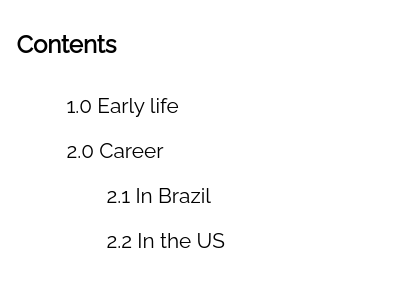

# Styling Ordered Lists with CSS Counters

I want an ordered list, and I want it to be pretty.
CSS has a pretty nifty trick up its sleeve to deal with this situation. It has a built-in counter mechanism.

Here's how that looks:

